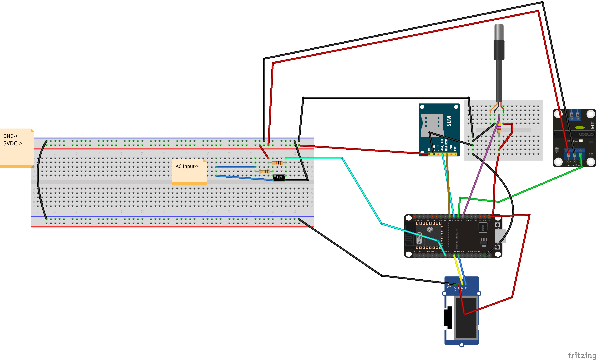
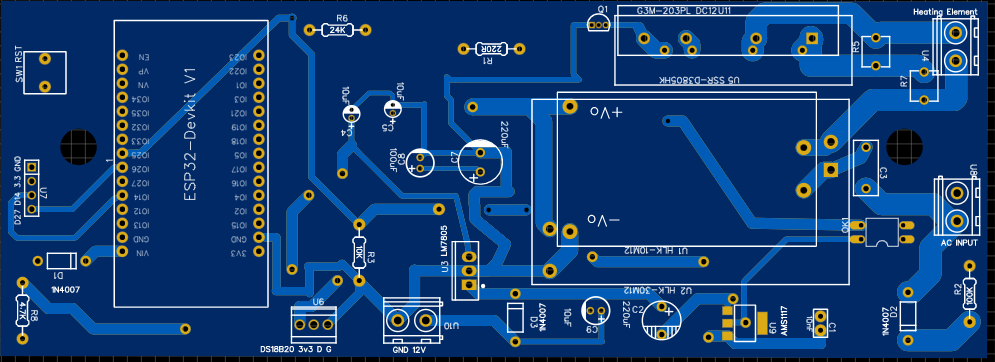
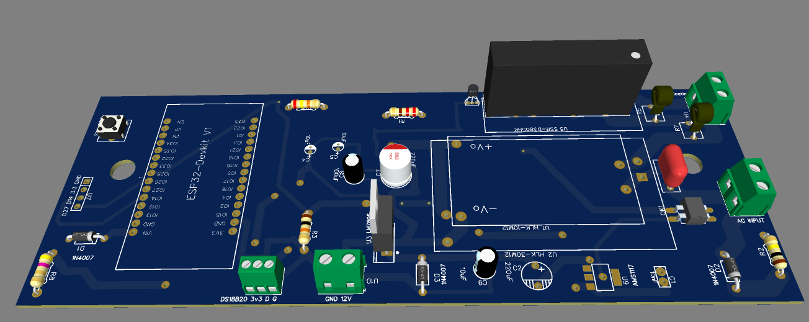

<p align="center">
  <a href="" rel="noopener">
 </a>
</p>

<h3 align="center">SmartTControl</h3>

<div align="center">

[]()

</div>

---

<p align="center"> SmartTControl ESP32 Firmware and Python based Backend
    <br> 
</p>

## 📝 Table of Contents

- [About](#about)
- [Getting Started](#getting_started)
- [Circuit](#circuit)
- [Server Details](#server)
- [MQTT Topic Details](#mqtt)
- [API Details](#api)
- [Usage](#usage)
- [List Of Components](#list)
- [Built Using](#built_using)
- [Authors](#authors)

## 🧐 About <a name = "about"></a>

This repo contains

- Backend
- Firmware
- Client auto-Installer script
- Detailed instructions

for SmartT Controller.

## Getting Started <a name = "getting_started"></a>

These instructions will get you a copy of the project up and running on your system.

### Prerequisites

Things you need to install the FW.

```
- Arduino IDE
```

### Installing <a name = "installing"></a>

A step by step series that tell you how to get the Firmware and Backend running

#### ESP32 Configuration

You should have Arduino IDE Installed

1.  Add ESP32 Board to your Arduino IDE
1.  In your Arduino IDE, go to File> Preferences
    Installing ESP32 Add-on in Arduino IDE Windows, Mac OS X, Linux open preferences
1.  Enter `https://dl.espressif.com/dl/package_esp32_index.json`
    into the “Additional Board Manager URLs” field then, click the “OK” button:
    Note: if you already have the ESP32 boards URL, you can separate the URLs with a comma(each board will go to neaw line) as follows:
    `https://dl.espressif.com/dl/package_esp32_index.json,\n http://arduino.esp8266.com/stable/package_esp8266com_index.json`

1.  Open the Boards Manager. Go to Tools > Board > Boards Manager…
1.  Search for ESP32 and press install button for the ESP32 by Espressif Systems“:
1.  That’s it. It should be installed after a few seconds.
1.  In your Arduino sketchbook directory, create tools directory if it doesn't exist yet.
1.  Unpack the tool into tools directory(present in libs/ESP32FS-1.0.zip) (the path will look like <home_dir>/Arduino/tools/ESP32FS/tool/esp32fs.jar).
1.  Close and re-open the Arduino IDE.

1.  Now copy the contents of the libs folder to the libraries directory of your Arduino
    1. If you are using windows, the libraries directory will be Documents/Arduino/libraries

##### ESP32 Node FW Uploading

1.  Select ESP32 Dev Module from Tools->Board->ESP32
2.  Select the correct port from Tools->Port
3.  Then open Firmware.ino file,
4.  Select Tools > ESP32 Sketch Data Upload menu item. This should start uploading the files into ESP32 flash file system.
5.  Now Upload the Code to your ESP32 Dev Module.
6.  Your ESP32 is now ready to be used.

## Circuit <a name = "circuit"></a>
### Circuit Diagram



### PCB






## Server Details <a name = "server"></a>

* This Section was used for WebScrapper based implementation of SmartTControl
### Monitoring

- CapRover

### List of Packages installed on server

- Mosquitto Broker
- NodeJS, NPM, Node, NVM
- PM2
- ufw
- Caprover
- Docker
- mongod
- mongo-express

### Version Details

- Node v12.16.1
- NPM v6.13.4


## API Details <a name = "api"></a>

### Live Sensor Nodes

```http
GET http://cmots.ca:8081/api/checkProductInfo
```

| Parameter | Type      | Description |
| :-------- | :-------- | :---------- |
| `imei` | `string` | IMEI of the device     |
| `email` | `string` | email address of the cmots account     |

-   Returns the data of live sensor in the format below.
```JSON
{
      "status": true,
      "userImeiProductData":
        {
        "Temperature": "15.70",
        "Humidity": "-1000.00",
        "Pressure": "-1000.00",
        "Battery": "-1000.00",
        "ServerTime": "2021-01-06 17:27:24.000"
    }
}
```
### Responses

The CMOTS can return the following responses
- user email not matched  
```javascript
{
    "status": false,
    "message": "User Not Found"
}
```
- device imei not matched  
```javascript
{
"status": false,
"message": "Product Not Found"
}

```

The `message` attribute contains a message commonly used to indicate errors or to return the logged status/

The `status` attribute describes if the transaction was successful or not.


## Usage <a name = "usage"></a>

1.  Upload the code to your ESP32.
2. Power on your ESP32, it will present you with an AP named `cmots-abc` (while `cmots` can be changed in the portal and `abc` is a unique id for each esp32)
3. Default captive portal password `12345678` which can be changed in captive portal. 
4. Connect to the ESP32 access point and open the web-browser and navigate to the link `http://cmots.local/_ac`. This link will work on most of the operating systems but if your operating system is not allowing to open it, you may want to check the captive portal IP Address from the serial monitor and can use that IP address inplace of the above mentioned URL. 
5. The default access IP Address is `http://192.168.4.1/_ac` 
6. You will be presented with a main dashboard as shown below(based on your device)
7.  Once connected to a WiFi network, you can again access the captive portal using same URL or the IP Address from the Serial monitor.
8.   You can open settings page with following default credentials
     1.  User: **cmots**
     2.  Password: **admin**

## ⛏️ Built Using <a name = "built_using"></a>

- [Python](https://www.python.org/) - Backend and Scrapper
- [C++](https://isocpp.org/) - Firmware
- [ESP32-Arduino-Core](https://github.com/espressif/arduino-esp32) - Arduino Core for ESP32
- [Arduino](arduino.cc/) - Arduino Environment

## ✍️ Authors <a name = "authors"></a>

- [@Nauman3S](https://github.com/Nauman3S) -  Initial work

<!-- See also the list of [contributors](https://github.com/kylelobo/The-Documentation-Compendium/contributors) who participated in this project.

## 🎉 Acknowledgements <a name = "acknowledgement"></a>

- Hat tip to anyone whose code was used
- Inspiration
- References -->
